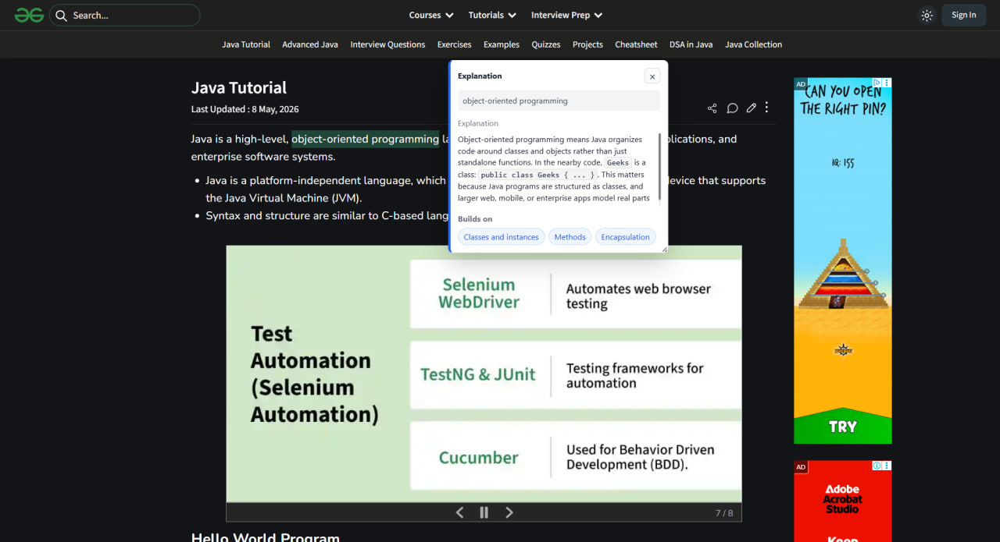

# FocusFlow

Chrome extension for technical reading. Highlight confusing text on a page, click
Explain, and FocusFlow streams a short primer in context.

## Prerequisites

- Node.js >= 18 (see `package.json` `engines.node`)
- An OpenAI API key (`OPENAI_API_KEY`) for `/api/primer`

## Quickstart (Local)

1. Clone the repo and `cd` into it.
2. Copy `.env.example` to `.env` and set `OPENAI_API_KEY`.
3. (Optional) Install packages: `npm install` (the backend uses minimal/no dependencies, but this is safe to run).
4. Start the local backend: `npm run dev` (defaults to `http://localhost:3000`).
5. Load the Chrome extension:
   - Open `chrome://extensions`, enable **Developer mode**.
   - Click **Load unpacked** and select the `extension/` folder.
6. Configure the extension:
   - Click the FocusFlow extension icon.
   - Set **Backend API Base** to `http://localhost:3000` and click **Save API Base**.
7. Visit a technical article, highlight text, then click **Explain**.

## Usage



## Local Setup

Follow the steps in **Quickstart (Local)** above. The key command to start the backend is `npm run dev`.

## Smoke Check

```bash
npm run smoke
```

This validates endpoint input/error handling without calling OpenAI.
